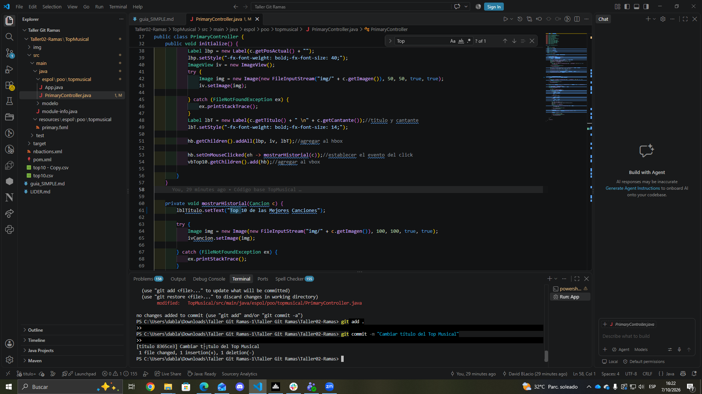
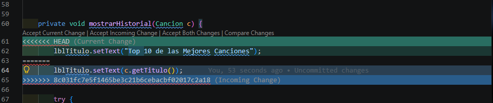
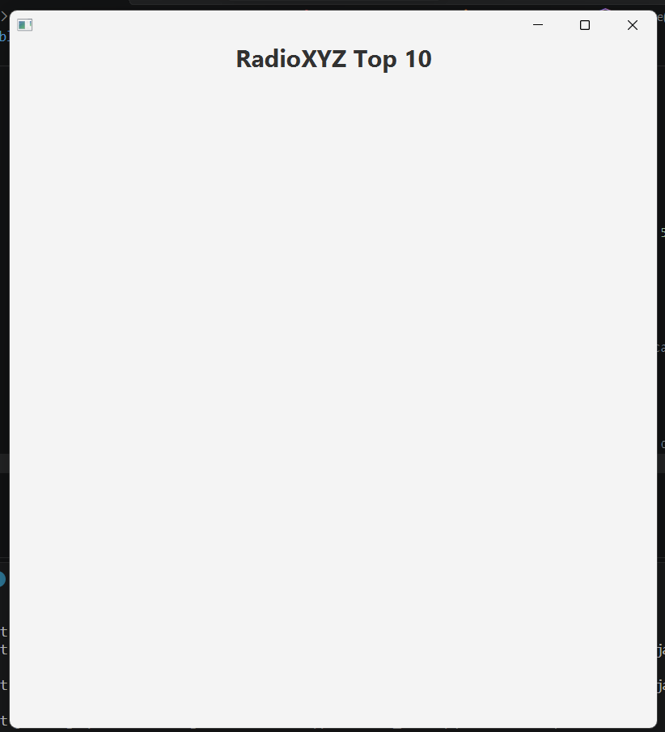
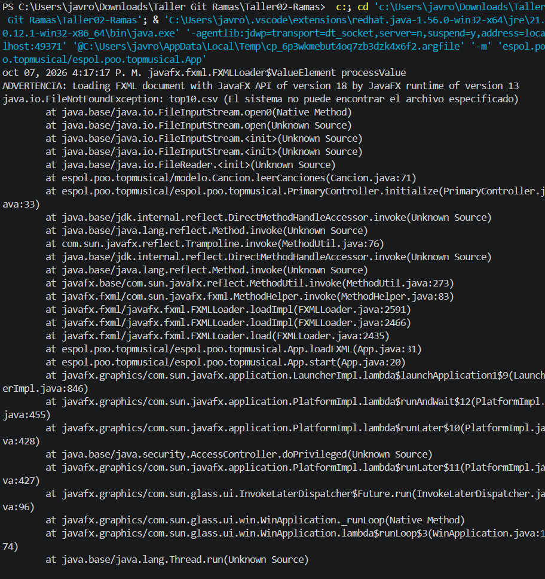
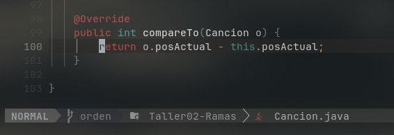
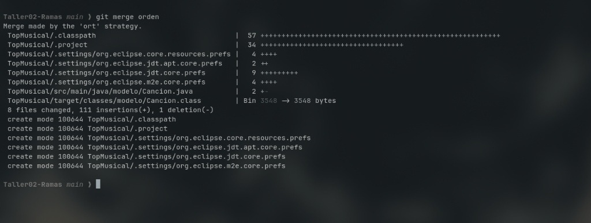

# Taller 02 - Ramas y Colaboración

## Integrantes
- David Blacio - dblacio16 - Lider
- Luke Silva - lxk3btw - Integrante 1
- Emilio Romo - emirobriones - Integrante 2

## Capturas 

## Lider 
### Cambio en el codigo y terminal

### Merge conflicto

## Integrante 1
### Cambio en el codigo y terminal

### Merge

## Integrante 2
### Cambio en el codigo y terminal

### Merge

